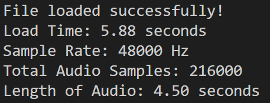
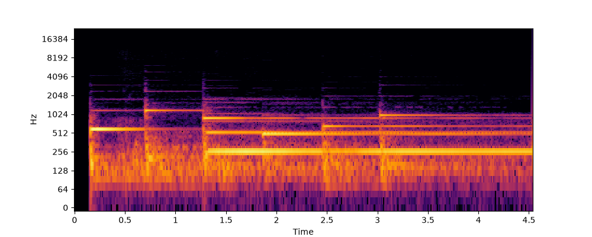

# week 1 (6.27.26 - 7.4.26)
researched spectrograms on wiki
ft, complex sinusoids, stft, spectrogram generation, windowing

introduction.py 
loads in audio file

prints load success, load time, sample rate, total audio samples, audio duration

calculates stft, turns amplitude into db
displays figure w specs

spectrogram data is matrix of values of size (frequencies, timestamps)

how to update github:
git add reports/week1.md reports/firstspectrogram.png
git commit -m "msg"
git push