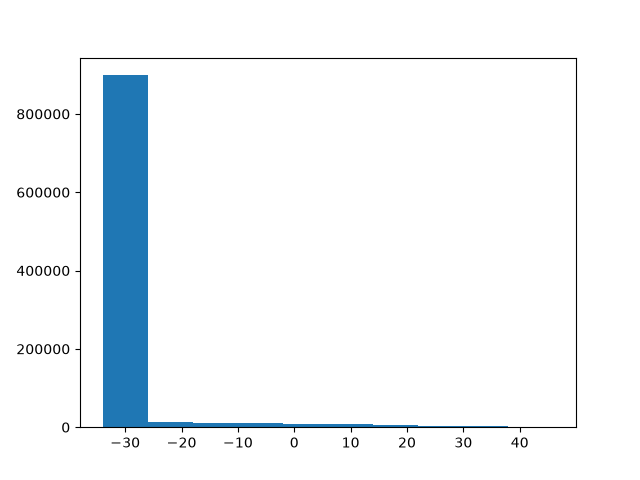
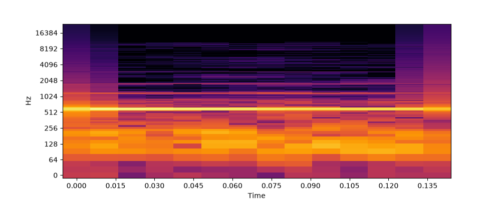
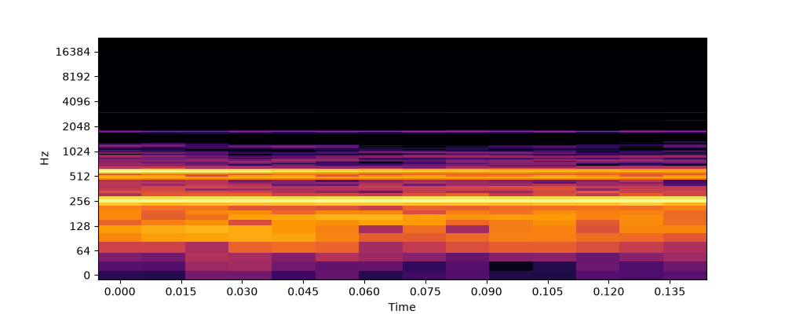
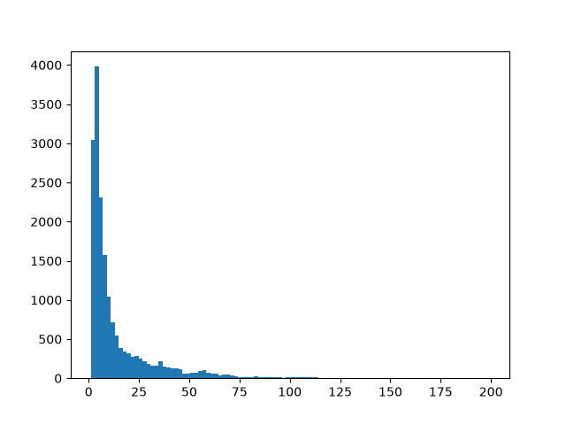
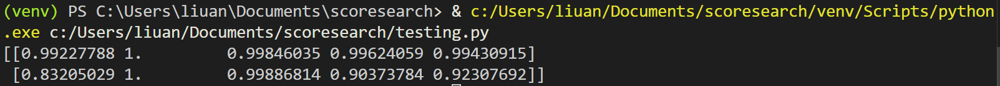
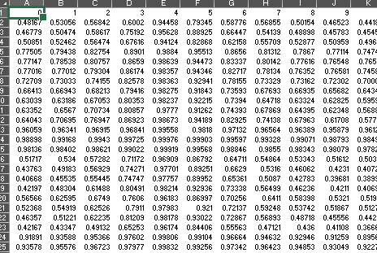

# week 2 (7.4.26 - 7.11.26)

values of spectrogram_db range from -30 to 40

basic value comparision using .allclose() yields no matches  
cross correlation with threshold 0.95 yields hundreds of results  
while 0.99999 yields one, the match is incorrect

decided to get rid of db comparison in favor of frequency  
although db is better for visual comparision, values differ when calculated and range of -30 to 40 makes differences in numbers diffucult to work with  
frequency numbers range from 0 - 200ish and the unintellegible frequencies can be ignored

best similarity metric
define similarity of frequency 

euclidean distance formula (coordinates) & cosine similarity (dot product with normalization from 0-1)

write new correlation function using cosine similarity: dot product / product of magnitudes

    |------ all one frequency over time
    |
    |
    |
array of arrays ^^^
outer array is for each frequency, each element is array of cosine similarities for each time stamp

attempted on 5 seconds of match 0:00.05 - 0:05.05 and 10 seconds of full 0:00.00 - 0:10.00

found matches on row 5 of the spreadsheet, suggests the code is working

